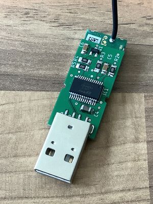
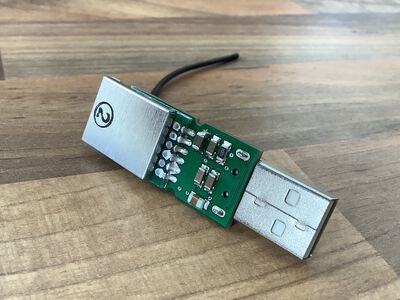
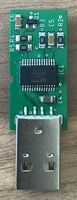
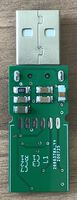
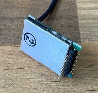
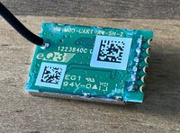
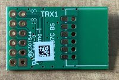
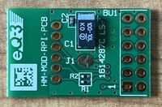

Smaller version of [HB-RF-USB](https://github.com/alexreinert/PCB). Electrically identical.  
Can be used to emulate a Homematic CCU with [RaspberryMatic](https://github.com/jens-maus/RaspberryMatic) in a virtual machine on x86 architecture.

The HM-MOD-RPI-PCB kit comes with pre-soldered pins on the HM-MOD-UART-AW-SH-2. You have to desolder them first:

  

## Required Parts

Shopping list with all used parts on [Reichelt](https://www.reichelt.de/my/1737625). You have to buy also one HM-MOD-RPI-PCB from ELV.

List:

- R (SMD 1206)
    - 1x 1 MΩ: [Reichelt](https://www.reichelt.de/smd-widerstand-1206-1-0-mohm-250-mw-1-rnd-1206-1-1m-p183429.html?&trstct=pol_0&nbc=1)
    - 1x 10 kΩ: [Reichelt](https://www.reichelt.de/smd-widerstand-1206-10-kohm-250-mw-1-rnd-1206-1-10k-p183394.html?&trstct=pol_0&nbc=1)
    - 3x 1 kΩ: [Reichelt](https://www.reichelt.de/smd-widerstand-1206-1-0-kohm-250-mw-1-rnd-1206-1-1-0k-p183379.html?&trstct=pol_2&nbc=1)
- C (SMD 1206)
    - 1x 100 µF: [Reichelt](https://www.reichelt.de/smd-vielschichtkondensator-g1206-100-f-6-3v-x5r-g1206-100-6-p89744.html?&trstct=pol_0&nbc=1)
    - 1x 4.7 µF: [Reichelt](https://www.reichelt.de/smd-kerko-1206-4-7-f-50-v-10-mlcc-rnd-1501206b475k-p254230.html?&trstct=pol_0&nbc=1)
    - 3x 100 nF: [Reichelt](https://www.reichelt.de/vielschicht-kerko-100nf-50v-125-c-kem-x7r1206b100n-p207152.html?&nbc=1)
    - 1x 10 nF: [Reichelt](https://www.reichelt.de/vielschicht-kerko-10nf-50v-125-c-kem-x7r1206b10n-p207144.html?&trstct=pol_3&nbc=1)
    - 1x 4.7 nF: [Reichelt](https://www.reichelt.de/vielschicht-kerko-4-7nf-50v-125-c-kem-x7r1206-4-7n-p207141.html?&trstct=pol_5&nbc=1)
- L (SMD 1206)
    - ≥33 nH; ≤1 Ω (DC): [Reichelt](https://www.reichelt.de/smd-induktivitaet-1206-keramik-220n-l-1206as-220n-p72972.html?&trstct=pol_11&nbc=1)
- IC
    - 1x FT232RL: [Reichelt](https://www.reichelt.de/rs232-interface-bruecke-usb-zu-uart-ssop-28-ft-232-rl-p64399.html?&nbc=1)
    - 1x HM-MOD-UART-AW-SH-2 (included in HM-MOD-RPI-PCB): [ELV](https://de.elv.com/elv-homematic-komplettbausatz-funkmodul-fuer-raspberry-pi-hm-mod-rpi-pcb-fuer-smart-home-hausautomation-142141)
- Misc
    - 1x IRLML6402: [Reichelt](https://www.reichelt.de/mosfet-p-ch-20v-3-7a-1-3w-sot-23-irlml-6402-p108743.html?&nbc=1)
    - 1x A-USB A-LP-SMT-C: [Reichelt](https://www.reichelt.de/usb-einbaustecker-serie-a-gerade-180-vers-usb-agf-p52008.html?&nbc=1), [Conrad](https://www.conrad.de/de/p/usb-stecker-ultra-flach-stecker-einbau-a-usb-a-lp-smt-c-usb-a-smt-assmann-wsw-inhalt-1-st-741461.html)

## Order PCB

Use the provided Gerber files under Releases in the GitHub repository or generate your own CAM using Autodesk EAGLE.

I ordered the PCBs from [JLCPCB](https://jlcpcb.com). If you use their service you have to specify dimensions `33 x 16 mm` in the order mask and also add the Remark

> 2x Slotted Holes

## Credits

- [@alexreinert/HB-RF-USB](https://github.com/alexreinert/PCB): Original idea.
- [@stan23/HB-MOD-UART-USB](https://github.com/stan23/myPCBs/tree/master/HB-MOD-UART-USB): Same goal as this project, but probably harder to solder due to 0603 SMD parts.